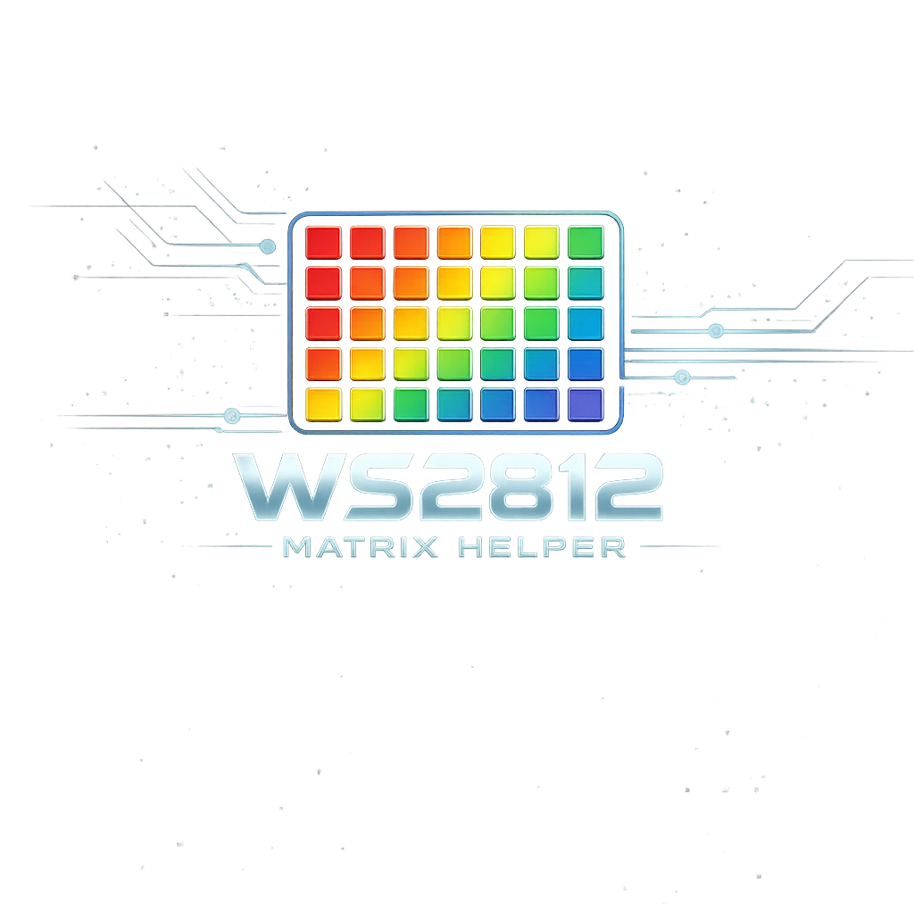

# WS2812 Model Helper



WS2812 点阵取模助手，用于把图片、文字、GIF/视频帧转换成 `ws2812_rgb_t` C 数组。

## 功能

- 支持图片取模、手动点亮取模、文字取模、GIF/视频动画取模。
- 支持 PNG/JPG/BMP/SVG 导入。
- 支持透明通道、边缘底色自动识别、指定底色抠除。
- 支持背景色、主体色调色盘。
- 支持 0/90/180/270 度旋转。
- 支持横向 Z 字、竖向 Z 字、普通行优先、普通列优先排列。
- 支持中文/英文界面、浅色/深色主题。
- 导出 STM32 工程可直接使用的 C 头文件。

## 运行源码

```powershell
py -3.12 -m pip install -r requirements.txt
py -3.12 ws2812_model_helper.py
```

## 构建单文件 EXE

```powershell
py -3.12 -m PyInstaller --noconfirm Ws2812ModelHelper.spec
```

生成文件：

```text
dist/Ws2812ModelHelper.exe
```

## 安装包

安装包位于 `release/Ws2812ModelHelperSetup.exe`，使用 Inno Setup 生成。

双击安装包后会进入标准安装向导，可选择安装位置、开始菜单文件夹和桌面快捷方式，并显示安装进度。

默认安装位置：

```text
C:\Program Files\WS2812 Matrix Helper
```

## 构建安装包

先构建 EXE，再生成安装包：

```powershell
py -3.12 -m PyInstaller --noconfirm Ws2812ModelHelper.spec
powershell -ExecutionPolicy Bypass -File .\packaging\make_installer.ps1
```
